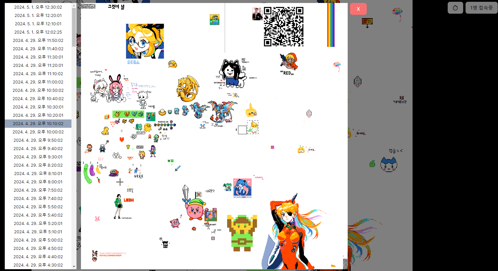

# place: yet another clone of r/place

fully implemented, deployed, but still in development

## TODO

- [x] daily backup, history
- [x] add screenshots to readme when it has a stack of pretty art
- [x] gallery of backups
- [ ] authentication
- [ ] live cursor display